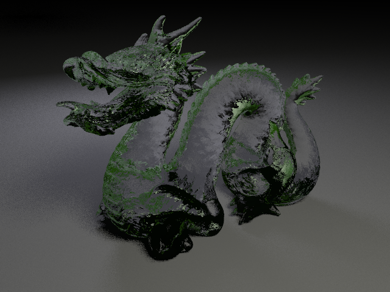

# CSE 168 Final Project

Group Members - Tarun Murugan and Jonathan Duong

## Project Plan
Throughout the course, we've been fascinated with a variety of rendering techniques and technologies that were covered. After reviewing a majority of them, we decided that we wanted to implement photon mapping into our path tracer. If we are successful in implementing photon mapping we may attempt machine learning powered monte carlo denoising. Although these topics seem completely different we found them most exciting, and reasonable.

## Progress
So far we have implemented photon tracing algorithm that uses russian roullete. We developed this as a preprocessing step for our renderer. We have validated that the photons are accurately collected, but we weren't able to correctly display the photon map. Here are our results. We used the scenes that were provided to use in our previous homeworks, but we plan on trying additional scenes in the future.

### ggx scene

### cornellBRDF scene

## Next Steps
Our next steps are to finish implementing photon transmission into our photon tracing algorithm and implement the photon gathering step in our renderer. Other than the resources provided to us in class, we are using a Stanford course we found online. Here is the link: https://graphics.stanford.edu/courses/cs348b-00/course8.pdf

# Final Project Submission

## Implementation
Our group followed the book 'Realistic Image Synthesis Using Photon Mapping' by Henrik Wann Jensen. The book details a two step process for rendering images with photon maps. The first step involves setting up the environment by casting photons from light sources. And the second step is collecting the radiance within a certain radius during rendering. We also used a stanford course and paper that was written by the author.

[link](http://graphics.ucsd.edu/~henrik/papers/photon_map/global_illumination_using_photon_maps_egwr96.pdf)
[link](https://graphics.stanford.edu/courses/cs348b-00/course8.pdf)

### Pre Processing Step
During the pre-processing step, we have to emit N number of photons from all light sources in the scene. After that, we trace each photon through the scene. If we hit a diffuse surface, we store the photon data and continue tracing, if we hit a specular surface we choose to reflect or refract, and if we absorb we store the photon data and terminate. After emitting and tracing N photons, we build a KD-Tree which is a spacial data structure. We used the KD-Tree for increased speed in search for photons within an area. We used an external library linked here:
[link](https://github.com/cdalitz/kdtree-cpp)

The KD-Tree search time was O(log(n)) so we were able to significantly reduce render time. We constructed and stored the tree in the scene data.

### Rendering Step
Based on the book, radiance estimation is relatively straightforward with these steps:

1) Cast ray from camera to scene
2) When the ray intersects an object check if it's a diffuse or specular object
   1) If diffuse, we query n number of photons, for example 200, and track the farthest photon from the hit position. We then calculate the BRDF at the hit. We tried using ggx and a modified-phong BRDF, but got similar results. Therefore, we sum the radiance as the BRDF * the photon power. Finally, we divide by the sampling area which is just the radius of the farthest photon squared * PI.
   2) If specular, we refract through the object and cast another ray at the other end of the object. We then conduct radiance estimation and the hit position of the ray cast after refraction. We chose to do this because all the specular objects are glass.
3) We then do final gathering to get the last global illumination contributions.
4) We return the final output and get some quality images

## Images

1,000,000 Photons, 100 Photons for radiance estimation

Photon Map 

5,000,000 Photons, 100 Photons for radiance estimation

Photon Map 

5,000,000 Photons, 100 Photons for radiance estimation, 128 samples per pixel

1,000,000 Photons, 100 Photons for radiance estimation

5,000,000 Photons, 100 Photons for radiance estimation

Photon Map 

