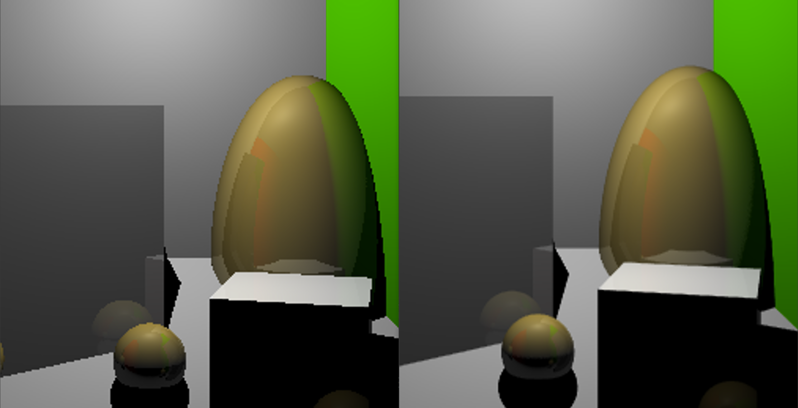
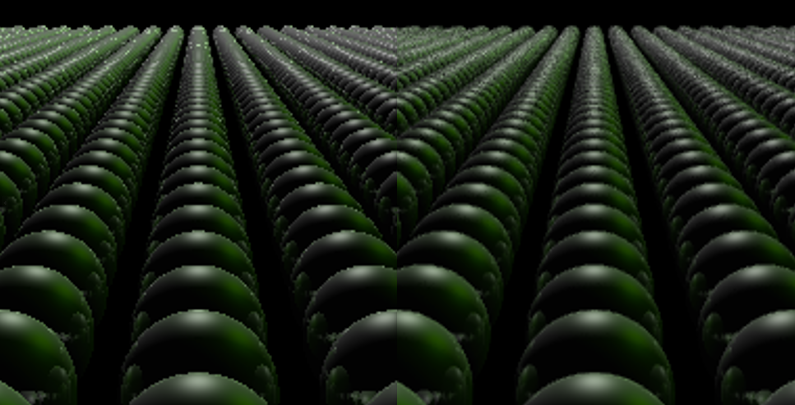

# CSE 168 HW 1 Write Up
In this homework we implemented 2 important features that improved the image quality of our rendered images. We discuss them in detail below.

## Antialiasing
We implemented an antialiasing technique where we generated n additional rays within each pixel. We calculated the color that each ray generates and find the average of all colors. Here are some examples of what our antialiasing algorithm generated.

In the image above we have the original scene 6 and on the right we have scene 6 with antialiasing. We used 10 samples so we were able to get smoother edges.

Here is another example. We rendered the original scene 5 on the left and scene 5 with antialiasing on the right. We can see here that the edges of the spheres are significantly smoother than the original.

Finally we have scene 4 and we can once again see that the edges of the objects in the frame are signifcantly smoother than in the original.