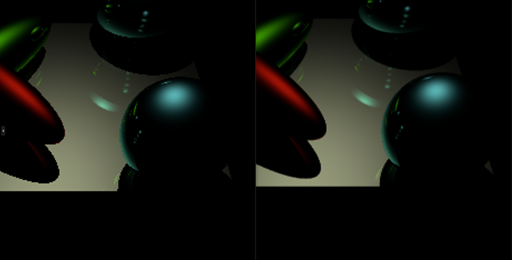
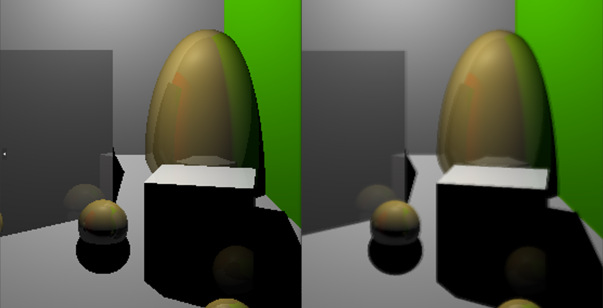

# CSE 168 HW 1 Write Up

In this homework we implemented 2 important features that improved the image quality of our rendered images. We discuss them in detail below.

## Antialiasing

We implemented an antialiasing technique where we generated n additional rays within each pixel. We calculated the color that each ray generates and find the average of all colors. Here are some examples of what our antialiasing algorithm generated.

In the image above we have the original scene 6 and on the right we have scene 6 with antialiasing. We used 10 samples so we were able to get smoother edges.

Here is another example. We rendered the original scene 5 on the left and scene 5 with antialiasing on the right. We can see here that the edges of the spheres are significantly smoother than the original.

Finally we have scene 4 and we can once again see that the edges of the objects in the frame are signifcantly smoother than in the original.

## Depth of Field

Here we have a depth of field example where we have the regular image on the left and the dof image on the right. We can see that there is a significant blur effect on the right image. We sampled multiple rays within a pixel, formed secondary rays and found the average color values of all the rays.

## Acceleration structure BVH tree

We implemented a BVH and here are the performance increases significantly.
scene4:
113ms
113.945ms

orig:
1414ms
1414.43ms

scene6:
625ms
625.318ms

orig:
3268ms
3268.13ms